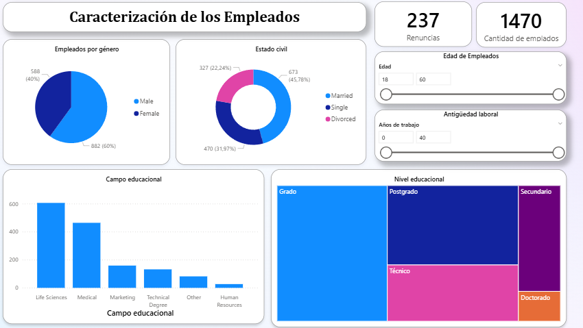
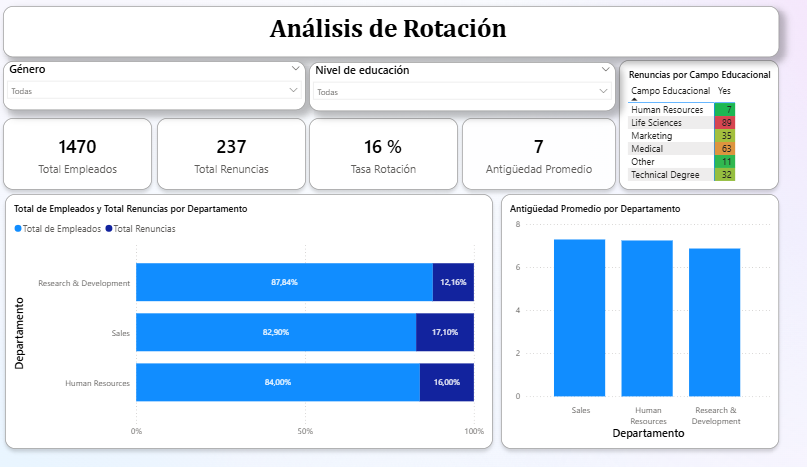

# MI PRIMER INFORME

## El dashboard está dividido en dos páginas, cada una con un enfoque distinto:
### Página 1: Caracterización de Empleados: Aquí se presenta una visión general del personal de la empresa.

### Página 2: Análisis de Rotación: En esta sección me sumergí en los KPIs de rotación. Para ello, utilicé un mapa de calor que me ayudó a identificar la correlación entre el nivel educativo y las tasas de renuncia.

### Para este proyecto, apliqué DAX para crear métricas y utilicé segmentadores para mejorar la interactividad en ambas páginas. La limpieza de datos, corrigiendo una variable que no era coherente, para obtener conclusiones más precisas.