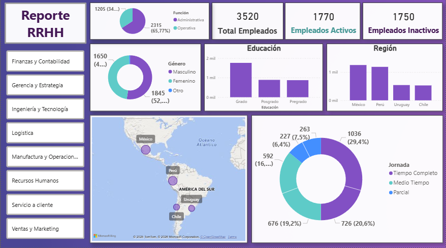
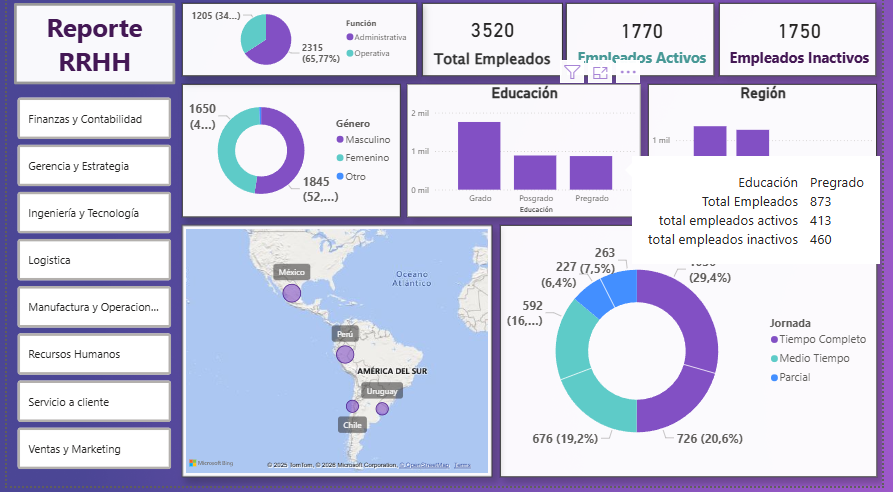
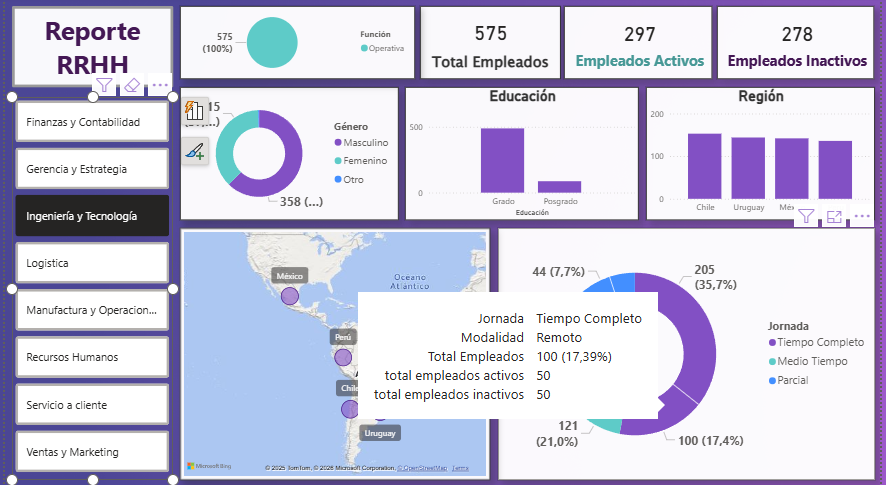

# 📊 Dashboard de Recursos Humanos – Power BI

Dashboard desarrollado en **Power BI Desktop** a partir de un dataset de **Recursos Humanos**, con el objetivo de analizar información clave sobre el personal y practicar el uso de visualizaciones, DAX y diseño de reportes.
---

## 🎯 Objetivo del proyecto

- Explorar y analizar datos de Recursos Humanos.  
- Crear un reporte visual claro y ordenado. 
- Practicar el uso de **medidas DAX** y visualizaciones.  
- Aplicar buenas prácticas de diseño en Power BI.  

---

## 🗂️ Dataset

- Fuente: Archivo Excel (dataset de Recursos Humanos)
- Contenido general:
  - Información de empleados
  - Áreas / sectores
  - Ubicación geográfica
  - Métricas relacionadas con el personal

> Los datos utilizados son de carácter educativo y no representan información real de una organización.

---

## 🛠️ Herramientas y tecnologías utilizadas

- Power BI Desktop  
- Power Query  
- DAX  
- Microsoft Excel  
- GitHub  

---

## 📌 Funcionalidades y conceptos aplicados

- Importación y exploración de datos desde Excel.  
- Uso de Power Query para la carga de datos.  
- Creación de **medidas implícitas y explícitas en DAX**.  
- Uso de la función `CALCULATE`.  
- Panel de filtros y segmentadores de datos.  
- Visualizaciones:
  - Tarjetas
  - Gráficos circulares y de anillo
  - Treemap
  - Mapas
- Uso de información sobre herramientas. 
- Formato y personalización de objetos visuales.  
- Aplicación de temas y ajustes del lienzo.  
- Organización del layout del reporte.  
- Bloqueo de objetos y ocultamiento de páginas.  

---

## 🖼️ Vista previa del dashboard

---

## 📚 Referencia

El proyecto fue desarrollado a partir de un **video tutorial de Power BI**, utilizado como guía de aprendizaje.  
Durante el proceso, se realizaron **ajustes y decisiones propias**, principalmente en la selección y modificación de visualizaciones, priorizando aquellas que facilitaran una mejor interpretación de los datos.